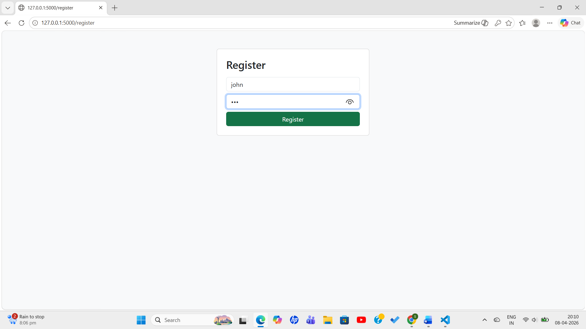
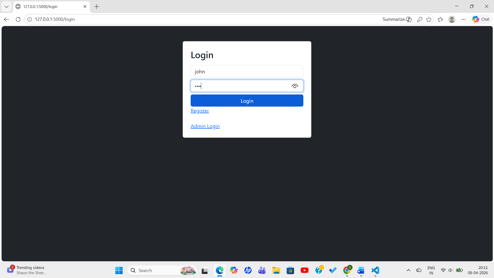
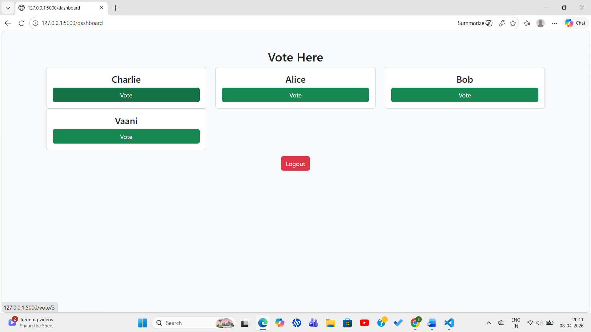
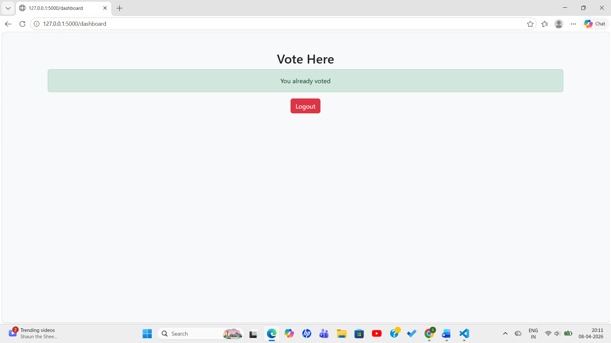
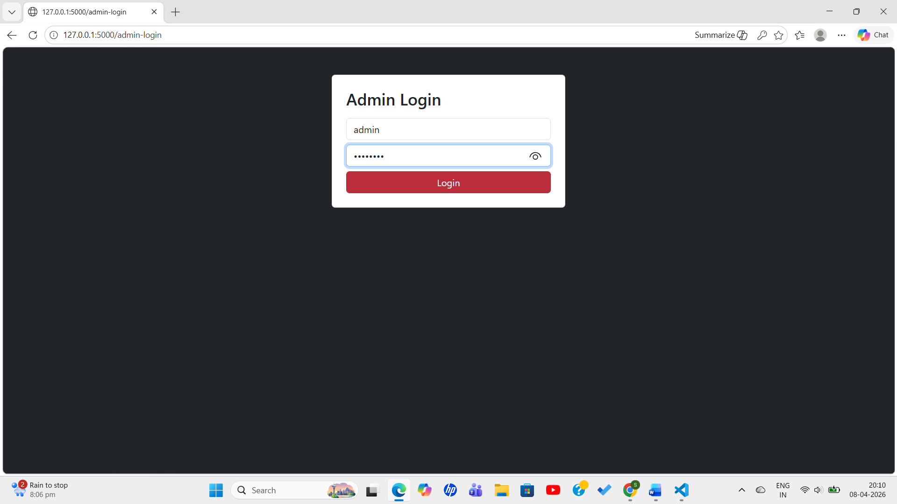
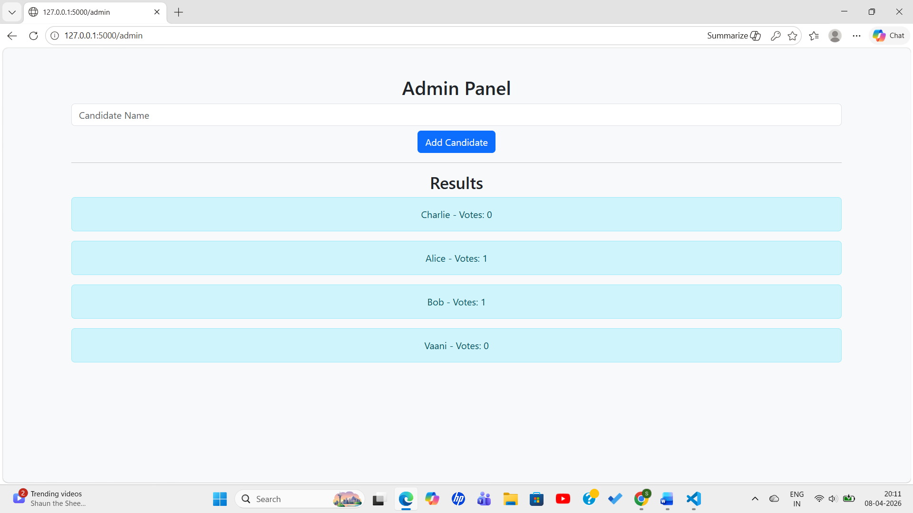

# online-voting-system
A full-stack **Online Voting System** built using **Python (Flask)** and **PostgreSQL**, with secure user authentication and an admin panel for managing candidates.
- Developed a web-based voting system using Flask and PostgreSQL
- Implemented user authentication and admin panel
- Ensured secure one-user-one-vote mechanism
- Deployed application on cloud (Render)
## 🚀 Features

### 👤 User Features

* User Registration & Login
* Secure Voting System
* One User = One Vote
* Session-based Authentication

### 👨‍💼 Admin Features

* Admin Login
* Add Candidates
* View Vote Results
* Role-based Access Control

---

## 🛠️ Tech Stack

* **Frontend:** HTML, CSS, Bootstrap
* **Backend:** Python (Flask)
* **Database:** PostgreSQL

## 📁 Project Structure

```
voting_system/
│
├── app.py
├── requirements.txt
├── images
├── templates/
│   ├── login.html
│   ├── register.html
│   ├── dashboard.html
│   ├── admin.html
│   ├── admin_login.html
```

## 🔐 Security Features

* Session-based authentication
* Role-based access (Admin/User)
* One vote per user restriction


## 💬 Description

This project demonstrates backend development, database integration, authentication, and deployment using modern tools.

### 📝 Register Page
This page allows new users to create an account by entering username and password.


### 🔐 Login Page
Registered users can log in securely using their credentials.


### 🗳️ Voting Dashboard
Users can vote for their preferred candidate. One vote per user is allowed.


### 🗳️ Voted
Once vote is done, user can logout.


### 👨‍💼 Admin Login
Admin logs in using authorized credentials to manage the system.


### ⚙️ Admin Panel
Admin can add candidates and view voting results.


